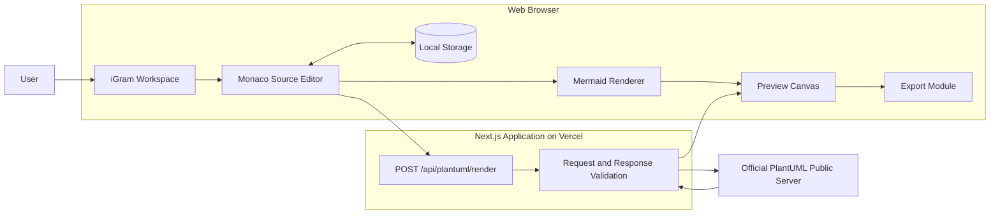

# iGram

**A unified web-based editor, previewer, and exporter for Mermaid and PlantUML diagrams.**

iGram provides a single workspace where users can paste or write diagram source code, view the rendered result, inspect it using zoom controls, resolve rendering errors, and export the latest valid diagram without switching between multiple preview websites.

> **Project status:** Phase 1 prototype specification and implementation.
>
> Phase 1 focuses on diagram editing, previewing, validation, zooming, local draft persistence, and export. AI-assisted conversion and code repair are planned for Phase 2.

---

## Table of Contents

- [Why iGram?](#why-iGram)
- [Phase 1 Features](#phase-1-features)
- [How It Works](#how-it-works)
- [Technology Stack](#technology-stack)
- [System Architecture](#system-architecture)
- [Getting Started](#getting-started)
- [Environment Variables](#environment-variables)
- [Available Scripts](#available-scripts)
- [PlantUML Public Server Integration](#plantuml-public-server-integration)
- [Export Formats](#export-formats)
- [Project Structure](#project-structure)
- [Testing](#testing)
- [Deployment](#deployment)
- [Phase 1 Limitations](#phase-1-limitations)
- [Phase 2 Roadmap](#phase-2-roadmap)
- [Project Documentation](#project-documentation)

---

## Why iGram?

Large Language Models such as ChatGPT, Gemini, and Claude commonly return Mermaid or PlantUML source code when users request software diagrams. The user must then find a separate preview website, identify the correct diagram language, paste the source, troubleshoot errors, and export the diagram.

iGram reduces that fragmented workflow by providing:

- One interface for both Mermaid and PlantUML.
- A source editor and rendered preview in the same workspace.
- Consistent zoom, error, loading, and export controls.
- Separate local drafts for each diagram language.
- A design that can later support AI conversion and code repair.

The primary target users are university students, lecturers, developers, software engineers, requirements engineers, system analysts, and non-technical users working with AI-generated diagram code.

---

## Phase 1 Features

### Diagram workspace

- Split-screen desktop interface with the source editor on the left and preview canvas on the right.
- Responsive stacked or switchable layout on smaller screens.
- Separate **Mermaid** and **PlantUML** tabs.
- Editable starter examples for first-time users.
- Syntax-aware editing through Monaco Editor.
- Independent browser drafts for Mermaid and PlantUML.

### Rendering

- Automatic debounced rendering after the user stops editing.
- Manual **Render** and **Retry** actions.
- In-browser Mermaid rendering.
- PlantUML rendering through a Next.js Route Handler and the official PlantUML public web server.
- Protection against stale asynchronous results replacing newer previews.
- Preservation of the last valid preview when a later render fails, where possible.

### Loading and error feedback

- Clear idle, waiting, rendering, success, stale, empty, and error states.
- Visible PlantUML loading message: **“Rendering with PlantUML public server…”**
- Loading indicator when no previous preview exists.
- Non-blocking loading overlay when a previous valid preview is available.
- User-friendly distinction between syntax errors, timeouts, invalid responses, and service availability problems.
- Accessible status announcements using an `aria-live` region.

### Diagram inspection

- Zoom range from **50% to 200%**.
- Zoom in and zoom out controls.
- Reset to 100%.
- Fit to View.
- Scrollable preview area for oversized diagrams.

### Export

- Export the latest valid diagram as:
  - SVG
  - PNG
  - Standalone HTML
- Disable exports while the current source is stale, invalid, or still rendering.
- Sanitize SVG output before display and export.

### Quality

- Keyboard-accessible primary controls.
- Responsive design.
- Local draft persistence without requiring an account.
- Unit, component, API, and end-to-end testing for critical workflows.

---

## How It Works

### Mermaid

1. The user enters Mermaid source in the editor.
2. iGram waits for the configured debounce period.
3. Mermaid renders the source directly in the browser.
4. The generated SVG is sanitized.
5. The preview canvas displays the latest valid diagram.

### PlantUML

1. The user enters PlantUML source in the editor.
2. The browser sends the source and requested format to `POST /api/plantuml/render`.
3. The Next.js Route Handler validates the request and rejects prohibited external-resource directives.
4. The server encodes the source using PlantUML’s URL format.
5. The server fetches the rendered image from the official PlantUML public web server.
6. iGram validates the response and returns it to the browser.
7. The preview remains in a loading state until the response has been received and the browser has decoded the image.

---

## Technology Stack

| Area | Technology |
|---|---|
| Web framework | Next.js 16 App Router |
| Programming language | TypeScript with strict mode |
| User interface | React 19, Tailwind CSS 4, shadcn/ui |
| Code editor | Monaco Editor |
| Client state | Zustand |
| Runtime validation | Zod |
| Mermaid renderer | Mermaid JavaScript package |
| PlantUML renderer | Official PlantUML public web server |
| Server integration | Next.js Route Handler |
| SVG sanitization | DOMPurify or an equivalent maintained sanitizer |
| Unit testing | Vitest |
| Component testing | React Testing Library |
| End-to-end testing | Playwright |
| Package manager | pnpm |
| Deployment target | Vercel |

No authentication service, database, Docker container, or separately deployed PlantUML service is required for Phase 1.

---

## System Architecture

iGram uses a lightweight client-server architecture. Mermaid is rendered locally in the browser, while PlantUML requests pass through a server-side application proxy before reaching the public PlantUML service.



### Architectural principles

- Keep rendering, state, export, and UI responsibilities separated.
- Treat all generated SVG as untrusted content.
- Keep PlantUML server configuration on the server side.
- Do not allow users to supply an alternative upstream PlantUML host.
- Ignore late rendering responses when a newer source revision exists.
- Keep Phase 2 AI services independent from the core editor and renderer modules.

---

## Getting Started

### Prerequisites

Install the following tools before running the project:

- Node.js **20.9 or newer**.
- pnpm.
- A modern browser such as Chrome, Edge, Firefox, or Safari.
- Internet access for PlantUML rendering through the public service.

### Installation

```bash
git clone <repository-url>
cd iGram
pnpm install
```

Create the local environment file:

```bash
cp .env.example .env.local
```

Start the development server:

```bash
pnpm dev
```

Open the application at:

```text
http://localhost:3000
```

No local PlantUML container or Java runtime is required.

---

## Environment Variables

Create `.env.local` using the values defined in `.env.example`:

```dotenv
# Official public PlantUML Web Server base URL.
# This value is used only by server-side Next.js code.
PLANTUML_SERVER_URL=https://www.plantuml.com/plantuml

# Maximum accepted UTF-8 PlantUML source size in bytes.
PLANTUML_MAX_SOURCE_BYTES=102400

# Maximum time allowed for a public-server rendering request.
PLANTUML_RENDER_TIMEOUT_MS=10000

# Maximum accepted PlantUML response size in bytes.
PLANTUML_MAX_RESPONSE_BYTES=5242880
```

### Configuration rules

- Do not prefix `PLANTUML_SERVER_URL` with `NEXT_PUBLIC_`.
- Browser code must call the application Route Handler rather than the public server directly.
- The upstream URL must use HTTPS outside automated tests.
- Only the expected official PlantUML host should be accepted in Phase 1.
- Do not commit `.env.local` or any machine-specific configuration.

---

## Available Scripts

The final script names depend on the generated repository, but the expected commands are:

```bash
# Start the development server
pnpm dev

# Create a production build
pnpm build

# Start the production server
pnpm start

# Run ESLint
pnpm lint

# Run TypeScript validation
pnpm typecheck

# Run unit and component tests
pnpm test

# Run end-to-end tests
pnpm test:e2e
```

Recommended verification before a release:

```bash
pnpm install --frozen-lockfile
pnpm lint
pnpm typecheck
pnpm test
pnpm test:e2e
pnpm build
```

---

## PlantUML Public Server Integration

Phase 1 uses the official PlantUML public web server to reduce deployment complexity and avoid running a Java or Docker-based renderer.

The browser does not contact the public service directly. Instead, iGram uses the following serverless endpoint:

```http
POST /api/plantuml/render
```

Example request:

```json
{
  "source": "@startuml\nAlice -> Bob: Hello\n@enduml",
  "format": "svg"
}
```

Supported API formats:

- `svg`
- `png`

Standalone HTML is generated by iGram from a successful sanitized SVG result.

### Privacy notice

PlantUML source submitted in Phase 1 is transmitted to a third-party public rendering service. Users should not enter confidential, proprietary, personal, or security-sensitive diagram content.

### Reliability notice

The public PlantUML server is an external dependency and does not have an availability guarantee controlled by this application. iGram therefore provides:

- A request timeout.
- Cancellation of obsolete requests.
- Response size and content-type validation.
- Safe error mapping.
- Retry controls.
- Preservation of the last valid preview when possible.
- Mocked upstream responses during normal automated tests.

---

## Export Formats

| Format | Purpose |
|---|---|
| SVG | Scalable diagram suitable for documents, websites, and further editing |
| PNG | Raster image suitable for slides, reports, and general sharing |
| HTML | Standalone page containing the latest valid sanitized diagram |

Exports always use the latest valid render corresponding to the current source. Export actions are disabled when the source has changed but the replacement preview has not rendered successfully.

---

## Project Structure

The implementation should follow this domain-oriented structure:

```text
.
├── app/
│   ├── api/
│   │   └── plantuml/
│   │       └── render/
│   │           └── route.ts
│   ├── globals.css
│   ├── layout.tsx
│   └── page.tsx
├── components/
│   ├── editor/
│   ├── preview/
│   ├── workspace/
│   └── ui/
├── features/
│   ├── diagram/
│   ├── export/
│   └── rendering/
├── hooks/
├── lib/
├── public/
├── tests/
│   ├── e2e/
│   ├── fixtures/
│   └── unit/
├── docs/
│   └── decisions/
├── DESIGN.md
├── GUIDE.md
├── .env.example
└── README.md
```

---

## Testing

### Unit tests

Unit tests should cover:

- Zoom clamping between 50% and 200%.
- Request and response schema validation.
- Local draft serialization and migration.
- Safe filename generation.
- PlantUML source encoding.
- Prohibited PlantUML directive detection.
- SVG sanitization.
- Render concurrency and stale-response handling.

### Component tests

Component tests should verify:

- Language tab switching.
- Independent Mermaid and PlantUML drafts.
- Empty, loading, success, stale, and error states.
- Export button availability.
- Accessible loading and error announcements.
- Preservation of a previous PlantUML preview during a replacement render.

### API tests

The PlantUML Route Handler should be tested for:

- Valid SVG and PNG requests.
- Invalid JSON and invalid schemas.
- Empty or oversized source.
- Unsupported output formats.
- Syntax or diagnostic responses.
- Timeouts and unavailable upstream service.
- Unexpected content types.
- Oversized or malformed upstream responses.

### End-to-end tests

Playwright should cover the primary user journeys:

1. Open the application and render the starter Mermaid example.
2. Edit Mermaid code and observe an updated preview.
3. Display an understandable Mermaid error without losing the source.
4. Switch to PlantUML while preserving the Mermaid draft.
5. Render PlantUML and keep the loading status visible until image decoding completes.
6. Display a recoverable PlantUML service error with Retry.
7. Use zoom, reset, and Fit to View.
8. Export valid SVG, PNG, and HTML files.
9. Reload the page and restore both local drafts.

Normal CI must mock the public PlantUML service to avoid network flakiness and unnecessary load. A live integration smoke test may be run manually or as an opt-in workflow.

---

## Deployment

iGram is designed for deployment as a single Next.js application on Vercel.

### Vercel deployment flow

1. Import the repository into Vercel.
2. Configure the environment variables from `.env.example`.
3. Confirm that the project uses pnpm.
4. Deploy the Next.js application.
5. Run a manual Mermaid render test.
6. Run a manual PlantUML public-server render test.
7. Verify loading, timeout, error, zoom, and export behavior.

The PlantUML Route Handler is deployed as part of the same Vercel application. No Docker service, Java runtime, separate backend server, or database is needed for Phase 1.

---

## Phase 1 Limitations

The initial prototype deliberately does not include:

- AI diagram generation.
- Mermaid-to-PlantUML conversion.
- PlantUML-to-Mermaid conversion.
- AI-assisted code correction or error explanation.
- User registration or authentication.
- Server-side saving or database storage.
- Shared links or real-time collaboration.
- Version history.
- Multiple open project files.
- Offline PlantUML rendering.
- Processing of confidential PlantUML source through a private renderer.

---

## Phase 2 Roadmap

Planned intelligent capabilities include:

- Convert Mermaid source to PlantUML.
- Convert PlantUML source to Mermaid.
- Detect syntax, compatibility, and rendering problems.
- Explain errors in user-friendly language.
- Suggest corrected source code.
- Allow users to review and apply AI-generated repairs.
- Compare the original and corrected source.
- Support configurable hosted or self-hosted LLM providers.

Phase 2 services should integrate through explicit interfaces rather than being coupled directly to the editor or preview components.

---

## Project Documentation

The repository includes two detailed project documents:

- [`DESIGN.md`](./DESIGN.md) — product scope, requirements, use cases, UX behavior, architecture, data and state design, test strategy, and acceptance criteria.
- [`GUIDE.md`](./GUIDE.md) — authoritative implementation instructions, coding standards, security constraints, API contract, testing requirements, and definition of done for the AI coding agent.

For the current Phase 1 PlantUML architecture, `GUIDE.md` is authoritative: the application uses the official public PlantUML server through a Next.js Route Handler and does not require a self-hosted container.

---

## Reference Documentation

- [Next.js documentation](https://nextjs.org/docs)
- [Mermaid documentation](https://mermaid.js.org/)
- [PlantUML Server documentation](https://plantuml.com/server)
- [Monaco Editor](https://microsoft.github.io/monaco-editor/)
- [Vercel documentation](https://vercel.com/docs)
- [Vitest documentation](https://vitest.dev/)
- [Playwright documentation](https://playwright.dev/)

---

**iGram — write diagram code, inspect the result, and export it from one workspace.**
